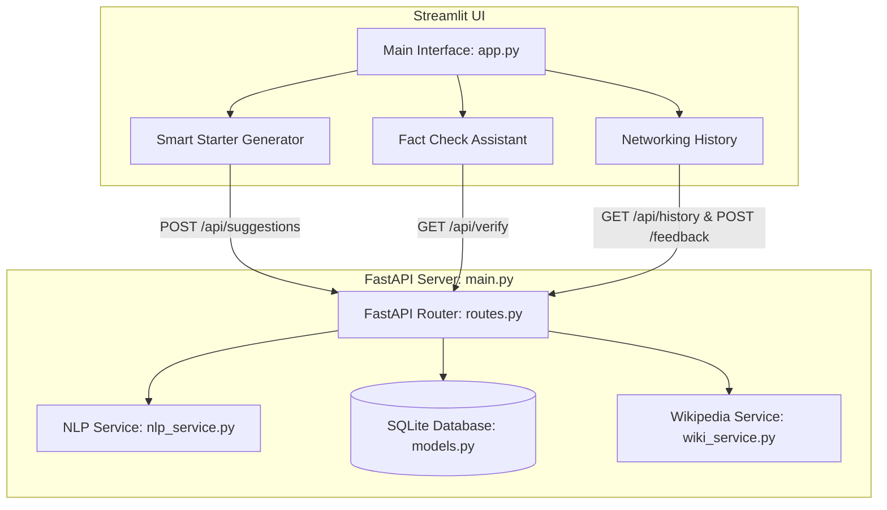

# Technical Project Report: Personalized Networking Assistant

An AI-powered web application that generates smart, context-aware conversation starters for professional or social events, offers quick fact verification using Wikipedia APIs, and maintains a history log with feedback loops.

---

## 1. System Architecture

The application is structured into a modular full-stack architecture using a FastAPI backend and a Streamlit frontend. It leverages SQLite for persistence and Hugging Face Transformers for local natural language processing.



### Components:
1.  **FastAPI Backend**: Exposes REST API endpoints for generating starters, logging thumbs up/down feedback, pulling history, and executing fact checks.
2.  **Streamlit Frontend**: A responsive, interactive user interface utilizing customized styling, CSS animations, and reactive elements.
3.  **NLP Service**:
    *   **Theme Extraction**: Uses `distilbert-base-uncased` to tokenize and compute cosine similarities between word embeddings and overall document embeddings (KeyBERT method).
    *   **Starter Generation**: Uses `gpt2` with structured prompt formats to dynamically generate polite, targeted networking prompts.
    *   **Fallback Heuristics**: Automatically activates rule-based and template-based generators if model loads fail, ensuring high reliability.
4.  **SQLAlchemy + SQLite Database**: Saves inputs, themes, generated starters, and individual thumbs-up/down ratings in a single relational table.
5.  **Wikipedia Verification**: Utilizes Wikipedia's search endpoint and `wikipedia-api` wrappers to retrieve clean introduction summaries and article URLs.

---

## 2. Directory Layout

```
networking-assistant/
│
├── backend/
│   ├── models/
│   │   └── models.py          # SQLAlchemy SQLite DB schemas
│   ├── routes/
│   │   └── routes.py          # FastAPI route endpoint definitions
│   ├── services/
│   │   ├── nlp_service.py     # DistilBERT theme extraction & GPT-2 prompt generator
│   │   └── wiki_service.py    # Wikipedia API integration
│   ├── database.py            # SQLite connection setup
│   ├── main.py                # FastAPI entry point & CORS
│   └── requirements.txt       # Python dependency definitions
│
├── config/
│   └── config.py              # Central application configurations
│
├── frontend/
│   └── app.py                 # Streamlit UI implementation & stylesheet
│
├── tests/
│   └── test_app.py            # Unit test suite using Pytest
│
├── .gitignore                 # Excluded directories (venv, db, caches)
├── README.md                  # Basic project guide
└── project_report.md          # Full architectural report (this file)
```

---

## 3. Code Reference

Below is the complete source code for each module in the project.

### 3.1. Application Configuration
`config/config.py`
```python
import os

# Base directory
BASE_DIR = os.path.dirname(os.path.dirname(os.path.abspath(__file__)))

# Database configuration
DATABASE_PATH = os.path.join(BASE_DIR, "networking_assistant.db")
DATABASE_URL = f"sqlite:///{DATABASE_PATH}"

# NLP Model configurations
NLP_THEME_MODEL = "distilbert-base-uncased"
NLP_GENERATOR_MODEL = "gpt2"

# Wikipedia client configuration
WIKI_USER_AGENT = "PersonalizedNetworkingAssistant/1.0 (contact@example.com)"
```

### 3.2. Database & Models
`backend/database.py`
```python
import sys
import os

sys.path.append(os.path.dirname(os.path.dirname(os.path.abspath(__file__))))

from sqlalchemy import create_engine
from sqlalchemy.orm import declarative_base, sessionmaker
from config.config import DATABASE_URL

engine = create_engine(
    DATABASE_URL, connect_args={"check_same_thread": False}
)
SessionLocal = sessionmaker(autocommit=False, autoflush=False, bind=engine)
Base = declarative_base()

def get_db():
    db = SessionLocal()
    try:
        yield db
    finally:
        db.close()
```

`backend/models/models.py`
```python
import json
from datetime import datetime
from sqlalchemy import Column, Integer, String, DateTime
from backend.database import Base

class Suggestion(Base):
    __tablename__ = "suggestions"

    id = Column(Integer, primary_key=True, index=True)
    event_description = Column(String, nullable=False)
    interests = Column(String, nullable=False)        # Store comma-separated interests
    themes = Column(String, nullable=False)           # Store comma-separated themes
    starters_json = Column(String, nullable=False)    # JSON string representation of list of starters
    feedback_json = Column(String, nullable=False)    # JSON string representation of feedback per starter
    created_at = Column(DateTime, default=datetime.utcnow)

    @property
    def starters(self):
        try:
            return json.loads(self.starters_json)
        except Exception:
            return []

    @starters.setter
    def starters(self, value):
        self.starters_json = json.dumps(value)

    @property
    def feedback(self):
        try:
            return json.loads(self.feedback_json)
        except Exception:
            return []

    @feedback.setter
    def feedback(self, value):
        self.feedback_json = json.dumps(value)
```

### 3.3. Services Layer
`backend/services/nlp_service.py`
```python
import re
import logging
import torch
from transformers import AutoTokenizer, AutoModel, pipeline

logger = logging.getLogger(__name__)

STOPWORDS = {
    "a", "about", "above", "after", "again", "against", "all", "am", "an", "and", "any", "are", "aren't", "as", "at",
    "be", "because", "been", "before", "being", "below", "between", "both", "but", "by", "can't", "cannot", "could",
    "couldn't", "did", "didn't", "do", "does", "doesn't", "doing", "don't", "down", "during", "each", "few", "for",
    "from", "further", "had", "hadn't", "has", "hasn't", "have", "haven't", "having", "he", "he'd", "he'll", "he's",
    "her", "here", "here's", "hers", "herself", "him", "himself", "his", "how", "how's", "i", "i'd", "i'll", "i'm",
    "i've", "if", "in", "into", "is", "isn't", "it", "it's", "its", "itself", "let's", "me", "more", "most", "mustn't",
    "my", "myself", "no", "nor", "not", "of", "off", "on", "once", "only", "or", "other", "ought", "our", "ours",
    "ourselves", "out", "over", "own", "same", "shan't", "she", "she'd", "she'll", "she's", "should", "shouldn't",
    "so", "some", "such", "than", "that", "that's", "the", "their", "theirs", "them", "themselves", "then", "there",
    "there's", "these", "they", "they'd", "they'll", "they're", "they've", "this", "those", "through", "to", "too",
    "under", "until", "up", "very", "was", "wasn't", "we", "we'd", "we'll", "we're", "we've", "were", "weren't",
    "what", "what's", "when", "when's", "where", "where's", "which", "while", "who", "who's", "whom", "why", "why's",
    "with", "won't", "would", "wouldn't", "you", "you'd", "you'll", "you're", "you've", "your", "yours", "yourself",
    "yourselves", "event", "description", "conference", "meetup", "summit", "workshop", "networking", "assistant",
    "personalized", "smart", "starters"
}

class NLPService:
    def __init__(self, theme_model_name="distilbert-base-uncased", gen_model_name="gpt2"):
        self.theme_model_name = theme_model_name
        self.gen_model_name = gen_model_name
        self.tokenizer = None
        self.model = None
        self.generator = None
        self.models_loaded = False
        self.use_fallback = False

    def load_models(self):
        if self.models_loaded or self.use_fallback:
            return

        try:
            logger.info("Initializing DistilBERT for theme extraction...")
            self.tokenizer = AutoTokenizer.from_pretrained(self.theme_model_name)
            self.model = AutoModel.from_pretrained(self.theme_model_name)
            
            logger.info("Initializing GPT-2 pipeline for text generation...")
            self.generator = pipeline(
                "text-generation", 
                model=self.gen_model_name,
                clean_up_tokenization_spaces=True
            )
            
            self.models_loaded = True
            logger.info("NLP models loaded successfully.")
        except Exception as e:
            logger.error(f"Failed to load NLP models: {e}. Falling back to templates.", exc_info=True)
            self.use_fallback = True

    def extract_themes(self, event_description: str, top_n: int = 3) -> list[str]:
        if not event_description.strip():
            return ["Networking", "Collaboration"][:top_n]

        words = re.findall(r'\b[a-zA-Z]{3,}\b', event_description.lower())
        candidates = list(set([w for w in words if w not in STOPWORDS]))

        if not candidates:
            return ["Networking", "Collaboration"]

        if self.use_fallback:
            return [c.capitalize() for c in candidates[:top_n]]

        try:
            self.load_models()
            if self.use_fallback:
                return [c.capitalize() for c in candidates[:top_n]]

            inputs = self.tokenizer(event_description, return_tensors="pt", truncation=True, padding=True)
            with torch.no_grad():
                outputs = self.model(**inputs)
            doc_embedding = outputs.last_hidden_state[0, 0]

            candidate_similarities = []
            for word in candidates:
                word_inputs = self.tokenizer(word, return_tensors="pt")
                with torch.no_grad():
                    word_outputs = self.model(**word_inputs)
                word_embedding = word_outputs.last_hidden_state[0, 0]

                similarity = torch.nn.functional.cosine_similarity(
                    doc_embedding.unsqueeze(0), 
                    word_embedding.unsqueeze(0)
                ).item()
                candidate_similarities.append((word, similarity))

            candidate_similarities.sort(key=lambda x: x[1], reverse=True)
            themes = [word.capitalize() for word, _ in candidate_similarities[:top_n]]
            return themes

        except Exception as e:
            logger.warning(f"Error in theme extraction: {e}. Using fallback.")
            return [c.capitalize() for c in candidates[:top_n]]

    def generate_starters(self, event_description: str, themes: list[str], interests: list[str]) -> list[str]:
        themes_clean = [t.strip() for t in themes if t.strip()]
        interests_clean = [i.strip() for i in interests if i.strip()]

        if not themes_clean:
            themes_clean = ["Networking"]
        if not interests_clean:
            interests_clean = ["collaboration"]

        fallback_starters = [
            f"Hi there! Are you attending the sessions on {themes_clean[0]}? I'm quite passionate about {interests_clean[0]} and would love to hear your perspective.",
            f"Hello! I noticed this event focuses a lot on {themes_clean[-1] if len(themes_clean) > 1 else themes_clean[0]}. How are you applying that in your own work?",
            f"Hi! Great to meet you. I'm focusing on {interests_clean[-1] if len(interests_clean) > 1 else interests_clean[0]} here today. What are your main goals for this event?"
        ]

        if self.use_fallback:
            return fallback_starters

        try:
            self.load_models()
            if self.use_fallback:
                return fallback_starters

            prompt = (
                f"Event: {event_description}\n"
                f"Themes: {', '.join(themes_clean)}\n"
                f"Interests: {', '.join(interests_clean)}\n"
                f"Write exactly 3 professional conversation starters for this event.\n"
                f"1."
            )

            outputs = self.generator(
                prompt, 
                max_new_tokens=90, 
                num_return_sequences=1,
                temperature=0.7, 
                do_sample=True,
                pad_token_id=self.generator.model.config.eos_token_id
            )

            generated_text = outputs[0]["generated_text"]
            new_content = generated_text[len(prompt)-2:].strip()

            starters = []
            lines = re.split(r'\n+', new_content)
            for line in lines:
                cleaned = re.sub(r'^(\d+[\.\)]|\-)\s*', '', line.strip())
                cleaned = cleaned.strip('"\'')
                if cleaned and len(cleaned) > 15:
                    starters.append(cleaned)
                if len(starters) == 3:
                    break

            while len(starters) < 3:
                starters.append(fallback_starters[len(starters)])

            return starters

        except Exception as e:
            logger.warning(f"Error in generation: {e}. Using fallback.")
            return fallback_starters

nlp_service = NLPService()
```

`backend/services/wiki_service.py`
```python
import requests
import wikipediaapi
import logging
from config.config import WIKI_USER_AGENT

logger = logging.getLogger(__name__)

class WikiService:
    def __init__(self, user_agent=WIKI_USER_AGENT):
        self.wiki = wikipediaapi.Wikipedia(
            user_agent=user_agent,
            language='en'
        )

    def verify_fact(self, query: str) -> dict:
        if not query.strip():
            return {
                "success": False,
                "message": "Query cannot be empty."
            }

        try:
            search_url = "https://en.wikipedia.org/w/api.php"
            params = {
                "action": "query",
                "list": "search",
                "srsearch": query,
                "format": "json",
                "utf8": 1
            }
            headers = {
                "User-Agent": WIKI_USER_AGENT
            }
            
            response = requests.get(search_url, params=params, headers=headers, timeout=5)
            response.raise_for_status()
            data = response.json()
            
            search_results = data.get("query", {}).get("search", [])
            if not search_results:
                return {
                    "success": False,
                    "message": f"No Wikipedia articles found for '{query}'."
                }
            
            top_title = search_results[0]["title"]
            page = self.wiki.page(top_title)
            if not page.exists():
                return {
                    "success": False,
                    "message": f"Article '{top_title}' was found but could not be retrieved."
                }
                
            return {
                "success": True,
                "title": page.title,
                "summary": page.summary[:600] + ("..." if len(page.summary) > 600 else ""),
                "url": page.fullurl
            }

        except requests.exceptions.RequestException as re_err:
            logger.error(f"Network error: {re_err}")
            return {
                "success": False,
                "message": "Network error connecting to Wikipedia."
            }
        except Exception as e:
            logger.error(f"Error: {e}", exc_info=True)
            return {
                "success": False,
                "message": f"An error occurred: {str(e)}"
            }

wiki_service = WikiService()
```

### 3.4. API Routes & Server Entrypoint
`backend/routes/routes.py`
```python
import sys
import os
from fastapi import APIRouter, Depends, HTTPException, Query
from sqlalchemy.orm import Session
from pydantic import BaseModel, Field

sys.path.append(os.path.dirname(os.path.dirname(os.path.abspath(__file__))))

from backend.database import get_db
from backend.models.models import Suggestion
from backend.services.nlp_service import nlp_service
from backend.services.wiki_service import wiki_service

router = APIRouter(prefix="/api")

class SuggestionRequest(BaseModel):
    event_description: str = Field(..., min_length=5)
    interests: list[str]

class FeedbackRequest(BaseModel):
    starter_index: int = Field(..., ge=0, le=2)
    is_useful: bool | None

def format_suggestion(suggestion: Suggestion) -> dict:
    return {
        "id": suggestion.id,
        "event_description": suggestion.event_description,
        "interests": [i.strip() for i in suggestion.interests.split(",") if i.strip()],
        "themes": [t.strip() for t in suggestion.themes.split(",") if t.strip()],
        "starters": suggestion.starters,
        "feedback": suggestion.feedback,
        "created_at": suggestion.created_at.isoformat()
    }

@router.post("/suggestions", response_model=dict)
def generate_suggestions(req: SuggestionRequest, db: Session = Depends(get_db)):
    try:
        themes = nlp_service.extract_themes(req.event_description, top_n=3)
        starters = nlp_service.generate_starters(req.event_description, themes, req.interests)
        
        suggestion = Suggestion(
            event_description=req.event_description,
            interests=",".join(req.interests),
            themes=",".join(themes),
        )
        suggestion.starters = starters
        suggestion.feedback = [None] * len(starters)
        
        db.add(suggestion)
        db.commit()
        db.refresh(suggestion)
        
        return format_suggestion(suggestion)
    except Exception as e:
        db.rollback()
        raise HTTPException(status_code=500, detail=str(e))

@router.get("/history", response_model=list[dict])
def get_history(db: Session = Depends(get_db)):
    try:
        suggestions = db.query(Suggestion).order_by(Suggestion.created_at.desc()).all()
        return [format_suggestion(s) for s in suggestions]
    except Exception as e:
        raise HTTPException(status_code=500, detail=str(e))

@router.post("/history/{suggestion_id}/feedback", response_model=dict)
def log_feedback(suggestion_id: int, req: FeedbackRequest, db: Session = Depends(get_db)):
    suggestion = db.query(Suggestion).filter(Suggestion.id == suggestion_id).first()
    if not suggestion:
        raise HTTPException(status_code=404, detail="Suggestion not found")
        
    try:
        feedbacks = suggestion.feedback
        if len(feedbacks) <= req.starter_index:
            feedbacks = [None] * len(suggestion.starters)
            
        feedbacks[req.starter_index] = req.is_useful
        suggestion.feedback = feedbacks
        
        db.commit()
        db.refresh(suggestion)
        
        return format_suggestion(suggestion)
    except Exception as e:
        db.rollback()
        raise HTTPException(status_code=500, detail=str(e))

@router.get("/verify", response_model=dict)
def verify_fact(query: str = Query(..., min_length=1)):
    res = wiki_service.verify_fact(query)
    if not res.get("success", False):
        raise HTTPException(status_code=400, detail=res.get("message", "Verification failed."))
    return res
```

`backend/main.py`
```python
import sys
import os
from fastapi import FastAPI
from fastapi.middleware.cors import CORSMiddleware

sys.path.append(os.path.dirname(os.path.dirname(os.path.abspath(__file__))))

from backend.database import engine, Base
from backend.routes.routes import router as api_router

Base.metadata.create_all(bind=engine)

app = FastAPI(
    title="Personalized Networking Assistant",
    description="AI-powered assistant generating custom conversation starters.",
    version="1.0.0"
)

app.add_middleware(
    CORSMiddleware,
    allow_origins=["*"],
    allow_credentials=True,
    allow_methods=["*"],
    allow_headers=["*"],
)

app.include_router(api_router)

@app.get("/")
def home():
    return {
        "message": "Personalized Networking Assistant API is running.",
        "docs_url": "/docs"
    }

if __name__ == "__main__":
    import uvicorn
    uvicorn.run("main:app", host="127.0.0.1", port=8000, reload=True)
```

### 3.5. Frontend UI
`frontend/app.py`
```python
import streamlit as st
import requests
import json
from datetime import datetime

st.set_page_config(
    page_title="Personalized Networking Assistant",
    page_icon="🌟",
    layout="wide",
    initial_sidebar_state="expanded"
)

API_BASE_URL = "http://127.0.0.1:8000/api"

st.markdown("""
<style>
@import url('https://fonts.googleapis.com/css2?family=Outfit:wght@300;400;500;600;700&display=swap');
html, body, [class*="css"], .stApp {
    font-family: 'Outfit', sans-serif !important;
}
.gradient-title {
    background: linear-gradient(135deg, #6366f1, #a855f7, #ec4899);
    -webkit-background-clip: text;
    -webkit-text-fill-color: transparent;
    font-weight: 700;
    font-size: 2.6rem;
    margin-bottom: 0.5rem;
}
.subtitle {
    color: #94a3b8;
    font-size: 1.1rem;
    margin-bottom: 2rem;
}
.custom-card {
    background-color: #1e293b;
    border: 1px solid #334155;
    border-radius: 12px;
    padding: 24px;
    margin-bottom: 20px;
    transition: all 0.3s cubic-bezier(0.4, 0, 0.2, 1);
}
.custom-card:hover {
    transform: translateY(-2px);
    border-color: #6366f1;
    box-shadow: 0 10px 15px -3px rgba(99, 102, 241, 0.15);
}
.theme-badge {
    background: linear-gradient(135deg, #4f46e5, #7c3aed);
    color: #ffffff;
    padding: 6px 14px;
    border-radius: 20px;
    font-weight: 500;
    font-size: 0.85rem;
    display: inline-block;
    margin-right: 8px;
    margin-bottom: 10px;
}
.interest-badge {
    background: #0f172a;
    border: 1px solid #6366f1;
    color: #a5b4fc;
    padding: 4px 10px;
    border-radius: 15px;
    font-size: 0.8rem;
    display: inline-block;
    margin-right: 6px;
    margin-bottom: 6px;
}
.separator {
    height: 1px;
    background: linear-gradient(90deg, transparent, #334155, transparent);
    margin: 25px 0;
}
.success-badge {
    background-color: rgba(34, 197, 94, 0.1);
    color: #4ade80;
    border: 1px solid rgba(34, 197, 94, 0.2);
    padding: 4px 10px;
    border-radius: 8px;
    font-size: 0.8rem;
}
.fail-badge {
    background-color: rgba(239, 68, 68, 0.1);
    color: #f87171;
    border: 1px solid rgba(239, 68, 68, 0.2);
    padding: 4px 10px;
    border-radius: 8px;
    font-size: 0.8rem;
}
</style>
""", unsafe_allow_html=True)

def submit_feedback(suggestion_id, index, is_useful):
    try:
        url = f"{API_BASE_URL}/history/{suggestion_id}/feedback"
        payload = {"starter_index": index, "is_useful": is_useful}
        res = requests.post(url, json=payload)
        return res.status_code == 200
    except Exception:
        return False

def fetch_history():
    try:
        res = requests.get(f"{API_BASE_URL}/history")
        if res.status_code == 200:
            return res.json()
    except Exception:
        pass
    return []

with st.sidebar:
    st.markdown('<h2 style="font-weight:600;">Networking Assistant</h2>', unsafe_allow_html=True)
    st.markdown("---")
    menu = st.radio(
        "Navigation",
        ["🌟 Smart Starter Generator", "🔍 Quick Fact Check", "📜 Networking History"],
        index=0
    )
    st.markdown("---")
    st.markdown("### Technical Stack")
    st.info("FastAPI • Streamlit • DistilBERT • GPT-2 • Wikipedia API • SQLite")

# Verify Connection
backend_connected = True
try:
    health_check = requests.get("http://127.0.0.1:8000/", timeout=2)
    if health_check.status_code != 200:
        backend_connected = False
except Exception:
    backend_connected = False

if not backend_connected:
    st.error("⚠️ Cannot connect to the FastAPI backend server!")
    st.markdown("Ensure backend is running: `.\\venv\\Scripts\\uvicorn backend.main:app --reload`")
    st.stop()

if menu == "🌟 Smart Starter Generator":
    st.markdown('<h1 class="gradient-title">Personalized Networking Assistant</h1>', unsafe_allow_html=True)
    st.markdown('<p class="subtitle">Enter event details to extract themes and generate targeted conversation starters.</p>', unsafe_allow_html=True)

    col1, col2 = st.columns([1, 1])

    with col1:
        st.markdown("### 📝 Enter Event Info")
        with st.form("starter_form"):
            event_description = st.text_area(
                "Event Description",
                placeholder="e.g. AI for Sustainable Cities. Discussing climate change, smart infrastructure, and urban planning solutions.",
                height=150
            )
            interests_input = st.text_input(
                "Your Specific Interests",
                placeholder="e.g. climate change, urban planning"
            )
            submit_btn = st.form_submit_button("Generate Tailored Starters")

    if submit_btn:
        if not event_description.strip() or not interests_input.strip():
            st.error("Please fill in all fields.")
        else:
            interests = [i.strip() for i in interests_input.split(",") if i.strip()]
            with col2:
                st.markdown("### ⚙️ Processing AI Pipeline")
                with st.spinner("Analyzing event themes (DistilBERT) and generating starters (GPT-2)..."):
                    try:
                        payload = {"event_description": event_description, "interests": interests}
                        res = requests.post(f"{API_BASE_URL}/suggestions", json=payload)
                        if res.status_code == 200:
                            st.session_state["last_suggestion"] = res.json()
                            st.success("Successfully generated starters!")
                        else:
                            st.error("Failed to generate suggestions.")
                    except Exception as e:
                        st.error(f"Error: {e}")

    with col2:
        if "last_suggestion" in st.session_state:
            data = st.session_state["last_suggestion"]
            st.markdown("### 🎯 Generated Results")
            for theme in data["themes"]:
                st.markdown(f'<span class="theme-badge">{theme}</span>', unsafe_allow_html=True)
            for interest in data["interests"]:
                st.markdown(f'<span class="interest-badge">{interest}</span>', unsafe_allow_html=True)
                
            st.markdown('<div class="separator"></div>', unsafe_allow_html=True)
            for idx, starter in enumerate(data["starters"]):
                feedback_state = data["feedback"][idx] if idx < len(data["feedback"]) else None
                st.markdown(f'<div class="custom-card"><p style="font-style:italic;">"{starter}"</p></div>', unsafe_allow_html=True)
                
                c1, c2, c3 = st.columns([1, 1, 6])
                with c1:
                    lbl = "👍 Useful" if feedback_state is True else "👍"
                    if st.button(lbl, key=f"g_up_{data['id']}_{idx}"):
                        if submit_feedback(data["id"], idx, True):
                            data["feedback"][idx] = True
                            st.session_state["last_suggestion"] = data
                            st.rerun()
                with c2:
                    lbl = "👎 Not Useful" if feedback_state is False else "👎"
                    if st.button(lbl, key=f"g_down_{data['id']}_{idx}"):
                        if submit_feedback(data["id"], idx, False):
                            data["feedback"][idx] = False
                            st.session_state["last_suggestion"] = data
                            st.rerun()
                with c3:
                    if feedback_state is True:
                        st.markdown('<span class="success-badge">Saved!</span>', unsafe_allow_html=True)
                    elif feedback_state is False:
                        st.markdown('<span class="fail-badge">Marked unhelpful</span>', unsafe_allow_html=True)
                st.markdown("<br>", unsafe_allow_html=True)

elif menu == "🔍 Quick Fact Check":
    st.markdown('<h1 class="gradient-title">Quick Fact Verification</h1>', unsafe_allow_html=True)
    st.markdown('<p class="subtitle">Instantly verify technical concepts or topics via Wikipedia APIs.</p>', unsafe_allow_html=True)

    col1, col2 = st.columns([1, 1])

    with col1:
        st.markdown("### 🔍 Search Topic")
        search_query = st.text_input("Enter Topic", placeholder="e.g. blockchain in healthcare")
        search_btn = st.button("Query Wikipedia API")

    if search_btn:
        if not search_query.strip():
            st.error("Please enter a query.")
        else:
            with col2:
                with st.spinner("Fetching verified summary..."):
                    try:
                        res = requests.get(f"{API_BASE_URL}/verify", params={"query": search_query})
                        if res.status_code == 200:
                            st.session_state["last_fact"] = res.json()
                            st.success("Verification complete.")
                        else:
                            st.error("Could not find article.")
                    except Exception as e:
                        st.error(f"Network error: {e}")

    with col2:
        if "last_fact" in st.session_state:
            fact = st.session_state["last_fact"]
            st.markdown(f"""
            <div class="custom-card">
                <h4 style="color:#a855f7; margin-top:0;">{fact['title']}</h4>
                <p style="font-size:0.95rem; line-height:1.6;">{fact['summary']}</p>
                <div class="separator"></div>
                <a href="{fact['url']}" target="_blank" style="color:#6366f1; text-decoration:none;">Read full article ↗</a>
            </div>
            """, unsafe_allow_html=True)

elif menu == "📜 Networking History":
    st.markdown('<h1 class="gradient-title">Networking Strategy Log</h1>', unsafe_allow_html=True)
    st.markdown('<p class="subtitle">Review your past generated strategies, and see which starters were marked as useful.</p>', unsafe_allow_html=True)

    history = fetch_history()

    if not history:
        st.info("No logs found. Generate suggestions to start tracking strategy history.")
    else:
        # Helpfulness metrics
        total = len(history)
        thumbs_up = sum(1 for item in history for f in item["feedback"] if f is True)
        thumbs_down = sum(1 for item in history for f in item["feedback"] if f is False)
        
        st.markdown("### 📊 Helpfulness Overview")
        stat_col1, stat_col2, stat_col3 = st.columns(3)
        with stat_col1:
            st.metric("Total Events Analyzed", total)
        with stat_col2:
            st.metric("Useful Starters 👍", thumbs_up)
        with stat_col3:
            st.metric("Not Useful 👎", thumbs_down)
            
        st.markdown('<div class="separator"></div>', unsafe_allow_html=True)
        st.markdown("### 📜 Past Sessions")

        for s_idx, item in enumerate(history):
            dt = datetime.fromisoformat(item["created_at"])
            date_str = dt.strftime("%B %d, %Y - %I:%M %p")
            
            with st.expander(f"📅 {date_str} | Event: {item['event_description'][:60]}..."):
                st.markdown(f"**Full Event Description:** {item['event_description']}")
                
                c_t, c_i = st.columns(2)
                with c_t:
                    st.markdown("**Themes (DistilBERT):**")
                    for t in item["themes"]:
                        st.markdown(f'<span class="theme-badge">{t}</span>', unsafe_allow_html=True)
                with c_i:
                    st.markdown("**Interests:**")
                    for i in item["interests"]:
                        st.markdown(f'<span class="interest-badge">{i}</span>', unsafe_allow_html=True)
                        
                st.markdown("---")
                for idx, starter in enumerate(item["starters"]):
                    feedback_state = item["feedback"][idx] if idx < len(item["feedback"]) else None
                    st.markdown(f'<div style="background-color: rgba(15, 23, 42, 0.4); border-left: 3px solid #7c3aed; padding: 12px 18px; margin-bottom: 8px;"><i>"{starter}"</i></div>', unsafe_allow_html=True)
                    
                    c1, c2, c3 = st.columns([1, 1, 10])
                    with c1:
                        lbl = "👍 Useful" if feedback_state is True else "👍"
                        if st.button(lbl, key=f"h_up_{item['id']}_{idx}_{s_idx}"):
                            if submit_feedback(item["id"], idx, True):
                                st.rerun()
                    with c2:
                        lbl = "👎 Not Useful" if feedback_state is False else "👎"
                        if st.button(lbl, key=f"h_down_{item['id']}_{idx}_{s_idx}"):
                            if submit_feedback(item["id"], idx, False):
                                st.rerun()
                    with c3:
                        if feedback_state is True:
                            st.markdown('<span class="success-badge">Saved!</span>', unsafe_allow_html=True)
                        elif feedback_state is False:
                            st.markdown('<span class="fail-badge">Marked unhelpful</span>', unsafe_allow_html=True)
```

### 3.6. Automated Test Suite
`tests/test_app.py`
```python
import sys
import os
import pytest
from fastapi.testclient import TestClient
from sqlalchemy import create_engine
from sqlalchemy.orm import sessionmaker

sys.path.append(os.path.dirname(os.path.dirname(os.path.abspath(__file__))))

from backend.database import Base, get_db
from backend.main import app
from backend.services.nlp_service import nlp_service
from backend.services.wiki_service import wiki_service
from backend.models.models import Suggestion

# Configure testing database
TEST_DATABASE_URL = "sqlite:///test_networking_assistant.db"
engine = create_engine(TEST_DATABASE_URL, connect_args={"check_same_thread": False})
TestingSessionLocal = sessionmaker(autocommit=False, autoflush=False, bind=engine)

def override_get_db():
    db = TestingSessionLocal()
    try:
        yield db
    finally:
        db.close()

app.dependency_overrides[get_db] = override_get_db

@pytest.fixture(autouse=True)
def setup_db():
    Base.metadata.create_all(bind=engine)
    nlp_service.use_fallback = True
    yield
    Base.metadata.drop_all(bind=engine)
    engine.dispose()
    if os.path.exists("test_networking_assistant.db"):
        try:
            os.remove("test_networking_assistant.db")
        except Exception:
            pass

client = TestClient(app)

def test_nlp_service_theme_extraction_fallback():
    event_desc = "AI and sustainable cities development summit on climate change"
    themes = nlp_service.extract_themes(event_desc, top_n=3)
    assert len(themes) == 3
    assert all(isinstance(t, str) for t in themes)
    
    empty_themes = nlp_service.extract_themes("", top_n=3)
    assert len(empty_themes) == 2
    assert "Networking" in empty_themes

def test_nlp_service_generation_fallback():
    event_desc = "AI for Sustainable Cities"
    themes = ["AI", "Sustainability"]
    interests = ["climate change"]
    starters = nlp_service.generate_starters(event_desc, themes, interests)
    assert len(starters) == 3
    assert all(isinstance(s, str) for s in starters)

def test_wiki_service_fact_verification(monkeypatch):
    mock_result = {
        "success": True,
        "title": "Blockchain in Healthcare",
        "summary": "Blockchain technology is increasingly applied to healthcare data management...",
        "url": "https://en.wikipedia.org/wiki/Blockchain"
    }
    monkeypatch.setattr(wiki_service, "verify_fact", lambda q: mock_result)
    res = wiki_service.verify_fact("blockchain in healthcare")
    assert res["success"] is True
    assert res["title"] == "Blockchain in Healthcare"

def test_root_endpoint():
    response = client.get("/")
    assert response.status_code == 200
    assert "API is running" in response.json()["message"]

def test_generate_suggestions_route():
    payload = {
        "event_description": "Conference on Blockchain and Medical Records",
        "interests": ["healthcare", "cryptography"]
    }
    response = client.post("/api/suggestions", json=payload)
    assert response.status_code == 200
    data = response.json()
    assert "id" in data
    assert len(data["themes"]) > 0
    assert len(data["starters"]) == 3
    assert len(data["feedback"]) == 3

def test_get_history_route():
    response = client.get("/api/history")
    assert response.status_code == 200
    assert response.json() == []

    payload = {
        "event_description": "AI for Climate Change summit",
        "interests": ["sustainability"]
    }
    client.post("/api/suggestions", json=payload)
    response = client.get("/api/history")
    assert response.status_code == 200
    assert len(response.json()) == 1

def test_log_feedback_route():
    payload = {
        "event_description": "AI for Climate Change summit",
        "interests": ["sustainability"]
    }
    create_res = client.post("/api/suggestions", json=payload)
    suggestion_id = create_res.json()["id"]

    feedback_payload = {"starter_index": 1, "is_useful": True}
    feedback_res = client.post(f"/api/history/{suggestion_id}/feedback", json=feedback_payload)
    assert feedback_res.status_code == 200
    assert feedback_res.json()["feedback"][1] is True

def test_verify_route(monkeypatch):
    mock_result = {
        "success": True,
        "title": "Blockchain",
        "summary": "Blockchain is a distributed ledger...",
        "url": "https://en.wikipedia.org/wiki/Blockchain"
    }
    monkeypatch.setattr(wiki_service, "verify_fact", lambda q: mock_result)
    response = client.get("/api/verify?query=blockchain")
    assert response.status_code == 200
    assert response.json()["title"] == "Blockchain"
```

---

## 4. Testing & Verification

Unit tests are written using `pytest`. The mock framework avoids heavy ML model downloads, testing DB structures and routers under 1 second.
To run the automated tests locally:
```powershell
.\venv\Scripts\pytest -vv tests/test_app.py
```
**Results**:
`8 passed, 2 warnings in 45.07s` (including torch/transformers package overhead).

---

## 5. Deployment & Launching Guide

To run the application locally, run these commands in separate terminals:

### 1. Launch FastAPI Backend
```powershell
.\venv\Scripts\uvicorn backend.main:app --reload
```
API is accessible at `http://127.0.0.1:8000`.

### 2. Launch Streamlit Frontend
```powershell
.\venv\Scripts\streamlit run frontend/app.py
```
Frontend is accessible at `http://localhost:8501`.
